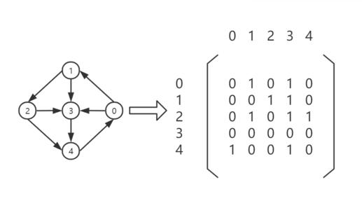
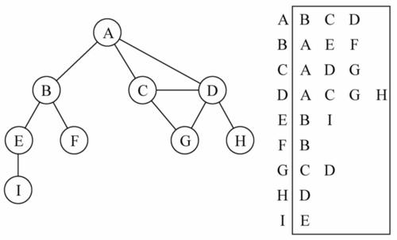

# 简述

图是由一组边链接的节点，任何二元关系都可以用图表示，由一组边链接的点叫相邻节点，一个顶点的“度”是其相邻节点的数量
图可以分为有向的无向的。也可以分为加权的和未加权

# 图的表示

**邻接矩阵**
图最常见的实现是邻接矩阵，即用一个二维数组表示顶点直接的链接，如果索引 i 的节点与索引 j 的节点相邻，那么 a[i][j]=1,不相邻那么就用 a[i][j]=0 表示，如下图所示。


邻接矩阵的缺点：如果不是强连通（两个节点在双向上都存在路径）的图

**邻接表**
可以使用邻接表的动态数据结构表示图，可以用列表(数组)、散列表、链表来表示相邻的的顶点列表。


# 图的创建

这里用邻接表来创建图，vertics 存储节点，然后用字典 Map 来表示邻接点

```
function Graph(){
  var vertics=[];
  var adjList=new Map();
  //添加顶点
  this.addVertics=function(v){
   vertics.push(v);
   adgList.set(v,[]);
  }
  //添加邻接点
  this.addEdge(v,e){
    adjList.get(v).push(e);
    adjList.get(e).push(v);
  }
}
```

# 图的遍历

图的遍历分为广度优先搜索和深度优先搜索，图的遍历可以用来寻找特定的顶点和两个顶点之间的路径、检查图是否是强连通图等
