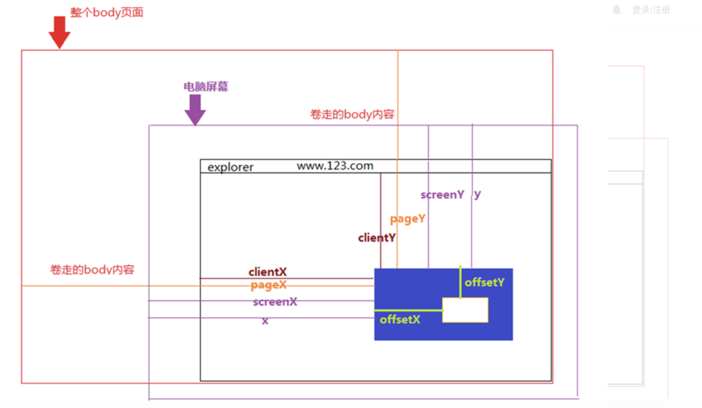

# client、offset、screen、page、inner 的区别

- client 是点击位置距离当前 body 可视区域的坐标,不包括横向滚动条或者竖向滚动条
- innerHeight 和 innerWidth 显示区域的高宽，包括横向滚动条和竖向滚动条
- offset 相对于带有定位的父盒子的坐标,相当于 position 的 left 和 right。dom 元素才有，不再 event 上
- screen 是当前电脑屏幕的坐标
- page 是整个页面的坐标，包括卷区的部分
  

# 拖拽的实现

- 建立拖拽的 div，这个 div 必须是绝对定位的
- 给这个 div 添加 mousedown 事件，获取当前的 clientX、clientY、offsetX、offsetY
- 给 document 添加 move 的监听事件，计算鼠标移动 client，移动的距离加上 offset 即盒子的定位
- 鼠标弹起去掉 move 的监听事件

```
  var el = document.getElementById('box')
    el.addEventListener('mousedown', (event) => {
      var startX = event.clientX,
        startY = event.clientY,
        left = el.offsetLeft,
        top = el.offsetTop
      var moveFun = (event) => {
        var X = event.clientX - startX
        var Y = event.clientY - startY
        let positionLeft = left + X > 0 ? left + X : 0
        let positionTop = top + Y > 0 ? top + Y : 0
        el.style.left = `${positionLeft}px`
        el.style.top = `${positionTop}px`
      }
      document.addEventListener('mousemove', moveFun)
      el.addEventListener('mouseup', () => {
        document.removeEventListener('mousemove', moveFun)
      })
    })
```
