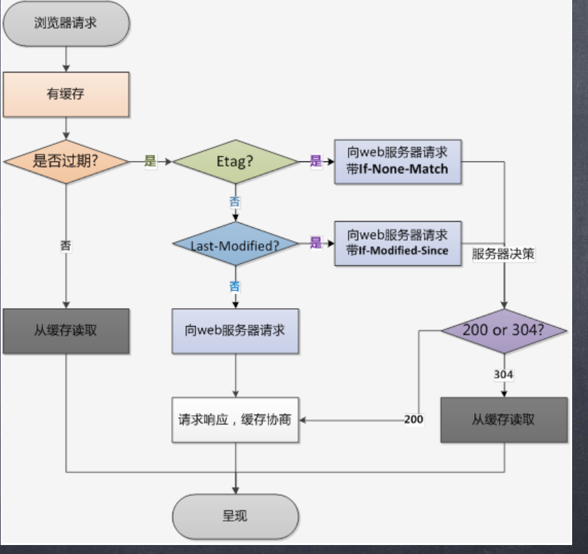

# 简介

缓存会根据请求保存输出内容的副本，例如html页面，图片，文件，当下一个请求来到的时候：如果是相同的URL，缓存直接使用副本响应访问请求，而不是向源服务器再次发送请求。缓存分为**强缓存和协商缓存**，缓存主要有以下优点：
- 减少相应延迟
- 减少网络带宽消耗

# 强缓存

强缓存不需要发送http请求到服务器，直接从浏览器本地获取，在chrom浏览器中的请求状态码为200，强缓存分为disk cache(硬盘缓存)和memory cache(内存缓存)，存入的位置由浏览器决定。是否使用强缓存入由响应头Expire、Cache-Control、Pragma 3控制

**disk cache和memory cache的区别**
- memory cache加载过的资源缓存再了内存当中，当浏览器管道的时候资源就不存在了，再次打开的浏览器进入的时候就不会出现from memory cache。刷新界面的时候会出现。

- disk cache，之前加载过该资源，直接从硬盘中获取，关闭浏览器后，数据依然存在。

**Expire**

Expire是http1.0的功能，返回的是一个日期，当浏览器发送请求的时候，会根据系统时间与Expire相比较，当系统时间大于Expire的时间时会发送请求。由于Expire的时间是和系统时间比较，当系统时间与服务器的时间不一致时会造成误差，所以在http1.1提出了cache-control。

**cache-control**
cache-control有以下属性值：
- no-store：不使用缓存，每次都是向服务器发起http请求，获取最小资源
- no-cache:不使用强缓存，可以使用协商缓存。
- max-age:缓存过期的时间，是个相对时间，单位为妙，值为10时表示使用的缓存10s后过期。
- private:专用个人的缓存，cdn、代理服务器不能使用。
- public：响应可以被中间代理、CDN 等缓存

**Pragma**
Pragma只有一个属性值no-cache，效果跟cache-control中no-cache相同，在三个强缓存中，优先级最高。当请求头一直带着Pragma: no-cache，是因为在chrome devtool里设置了disable cache。

**强缓存优先级：pragma>cache-control>Expire**

# 协商缓存
**协商缓存的状态码都是304**，当强缓存失效或者请求头里面if-modified-since和if-none-match会采用协商缓存。

**ETag/If-None-Match**
ETag/If-None-Match的值是一串hash码，代表的资源标识符，当文件内容发生变化时，hash值会发生变化。第一次发送请求的时候，如果响应头里面有Etag，那么会在磁盘中将响应内容按照Etag相关的规则以文件夹保存起来，再次发送该请求时，请求头中会携带if-none-match，值为上次保存的etag值，这时会与服务器中的Etag比较，如果相同，那么则使用缓存中的内容，返回304状态码，如果不相同，就获取新的资源，并且更新磁盘中与该请求相关的etag缓存内容。

ETag 又有强弱校验之分，如果 hash 码是以 "W/" 开头的一串字符串，说明此时协商缓存的校验是弱校验的，只有服务器上的文件差异（根据 ETag 计算方式来决定）达到能够触发 hash 值后缀变化的时候，才会真正地请求资源

**Last-Modified/If-Modified-Since**
Last-Modified/If-Modified-Since代表的是最后修改的时间，是个绝对时间，第一次发送请求的时候，响应的时候如果有last-modify，那么会在磁盘中保存按照last-modify的规则保存响应内容，再次请求的时候，会在请求头中if-mofified-since，值为上次请求响应的last-modify值，如果值相同，那么就返回304状态码，不同则再次发起请求。

**ETag/If-None-Match与Last-Modified/If-Modified-Since的比较**

- 当请求中同时出现ETag/If-None-Match与Last-Modified/If-Modified-Since两套缓存规则时，它会优先校验ETag/If-None-Match，如果ETag/If-None-Match命中缓存，那么就直接采用ETag/If-None-Match的缓存，如果没有命中再判断Last-Modified/If-Modified-Since缓存。
- 如果文件的修改频率在秒级以下，Last-Modified/If-Modified-Since 会错误地返回 304
- 如果文件被修改了，但是内容没有任何变化的时候，Last-Modified/If-Modified-Since 会错误地返回 304 。

# 总结
- 当发送请求时，首先判断memory cache是否有缓存，如果有就采用
- memory cache中没有，那么会查看disk cache中是否有缓存，如果有就采用disk cache
- 如果disk cache中没有，再检查是否有协商缓存，如果命中协商缓存，那么就采纳协商缓存，如果没有，获取的就是最新的内容。

# 参考
https://juejin.im/post/5eb7f811f265da7bbc7cc5bd
